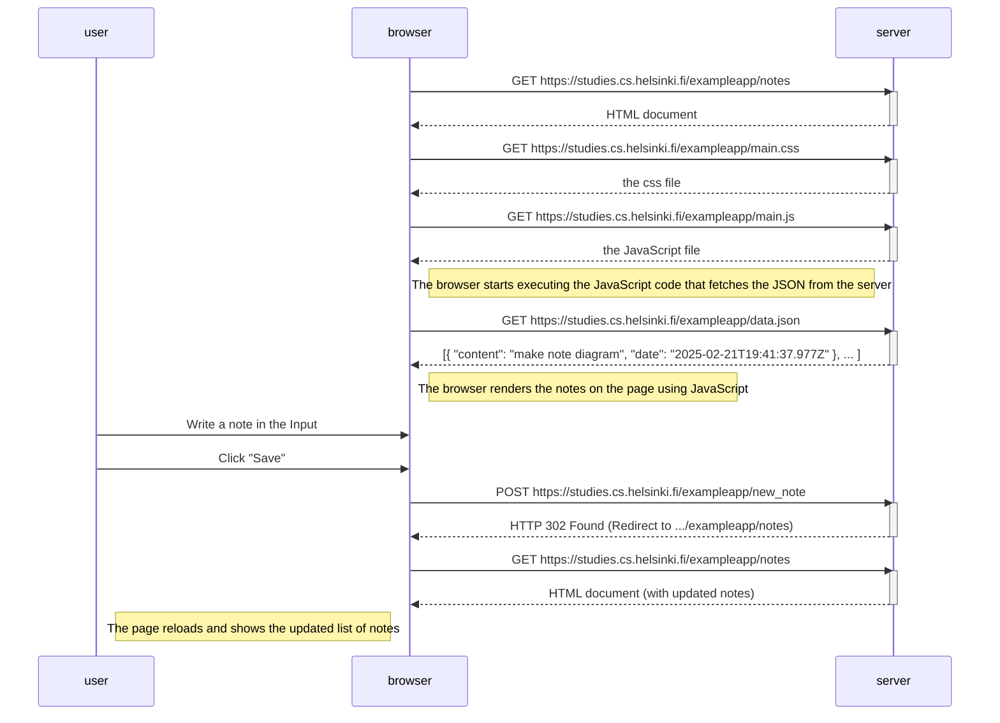

```mermaid

sequenceDiagram
    participant user
    participant browser
    participant server

    browser->>server: GET https://studies.cs.helsinki.fi/exampleapp/notes
    activate server
    server-->>browser: HTML document
    deactivate server

    browser->>server: GET https://studies.cs.helsinki.fi/exampleapp/main.css
    activate server
    server-->>browser: the css file
    deactivate server

    browser->>server: GET https://studies.cs.helsinki.fi/exampleapp/main.js
    activate server
    server-->>browser: the JavaScript file
    deactivate server

    Note right of browser: The browser starts executing the JavaScript code that fetches the JSON from the server

    browser->>server: GET https://studies.cs.helsinki.fi/exampleapp/data.json
    activate server
    server-->>browser: [{ "content": "make note diagram", "date": "2025-02-21T19:41:37.977Z" }, ... ]
    deactivate server

    Note right of browser: The browser renders the notes on the page using JavaScript

    user->>browser: Write a note in the Input
    user->>browser: Click "Save"
    browser->>server: POST https://studies.cs.helsinki.fi/exampleapp/new_note
    activate server
    server-->>browser: HTTP 302 Found (Redirect to .../exampleapp/notes)
    deactivate server

    browser->>server: GET https://studies.cs.helsinki.fi/exampleapp/notes
    activate server
    server-->>browser: HTML document (with updated notes)
    deactivate server

    Note left of browser: The page reloads and shows the updated list of notes

```
