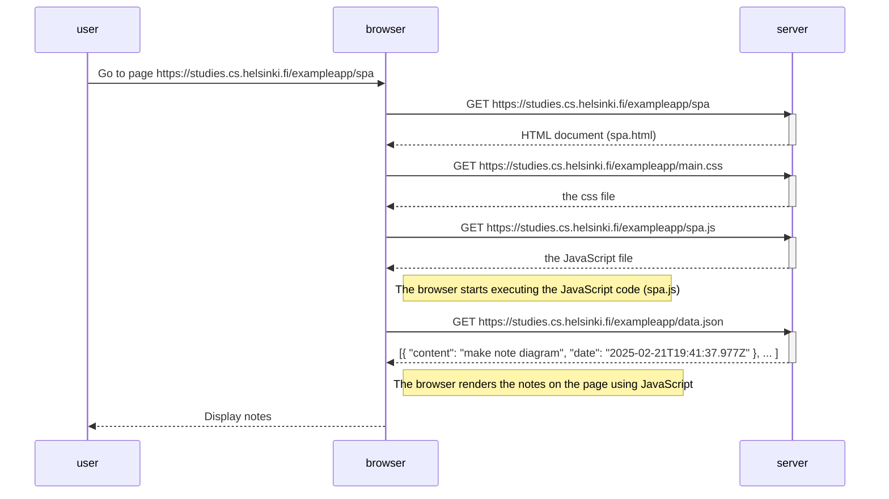

```mermaid

sequenceDiagram
    participant user
    participant browser
    participant server

    user->>browser: Go to page https://studies.cs.helsinki.fi/exampleapp/spa
    browser->>server: GET https://studies.cs.helsinki.fi/exampleapp/spa
    activate server
    server-->>browser: HTML document (spa.html)
    deactivate server

    browser->>server: GET https://studies.cs.helsinki.fi/exampleapp/main.css
    activate server
    server-->>browser: the css file
    deactivate server

    browser->>server: GET https://studies.cs.helsinki.fi/exampleapp/spa.js
    activate server
    server-->>browser: the JavaScript file
    deactivate server

    Note right of browser: The browser starts executing the JavaScript code (spa.js)

    browser->>server: GET https://studies.cs.helsinki.fi/exampleapp/data.json
    activate server
    server-->>browser: [{ "content": "make note diagram", "date": "2025-02-21T19:41:37.977Z" }, ... ]
    deactivate server

    Note right of browser: The browser renders the notes on the page using JavaScript

    browser-->>user: Display notes

```
