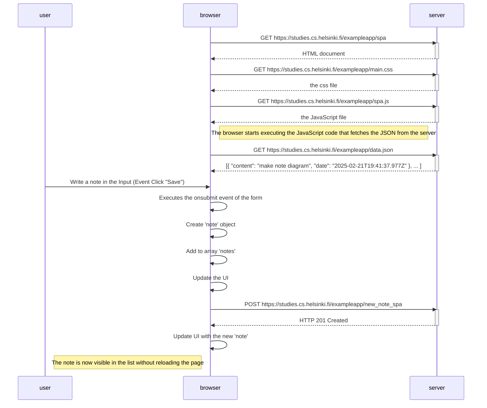

```mermaid

sequenceDiagram
    participant user
    participant browser
    participant server

    browser->>server: GET https://studies.cs.helsinki.fi/exampleapp/spa
    activate server
    server-->>browser: HTML document
    deactivate server

    browser->>server: GET https://studies.cs.helsinki.fi/exampleapp/main.css
    activate server
    server-->>browser: the css file
    deactivate server

    browser->>server: GET https://studies.cs.helsinki.fi/exampleapp/spa.js
    activate server
    server-->>browser: the JavaScript file
    deactivate server

    Note right of browser: The browser starts executing the JavaScript code that fetches the JSON from the server

    browser->>server: GET https://studies.cs.helsinki.fi/exampleapp/data.json
    activate server
    server-->>browser: [{ "content": "make note diagram", "date": "2025-02-21T19:41:37.977Z" }, ... ]
    deactivate server

    user->>browser: Write a note in the Input (Event Click "Save")
    browser->>browser: Executes the onsubmit event of the form
    browser->>browser: Create 'note' object
    browser->>browser: Add to array 'notes'
    browser->>browser: Update the UI
    browser->>server: POST https://studies.cs.helsinki.fi/exampleapp/new_note_spa
    activate server
    server-->>browser: HTTP 201 Created
    deactivate server
    browser->>browser: Update UI with the new 'note'
    Note left of browser: The note is now visible in the list without reloading the page

```
